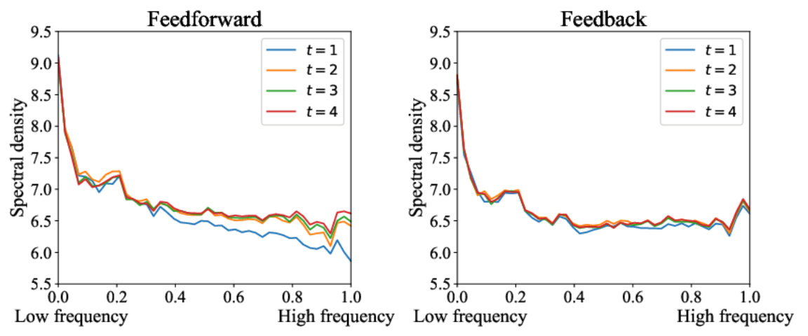

# SR\_Framework
## A generic super-resolution framework which implements the following networks (Updating...)
* LatticeNet [[ECCV2020](https://www.ecva.net/papers/eccv_2020/papers_ECCV/papers/123670273.pdf)]
* IMDN [[ACM MM2019](https://dl.acm.org/doi/abs/10.1145/3343031.3351084)] 
* IDN [[CVPR2018](https://openaccess.thecvf.com/content_cvpr_2018/html/Hui_Fast_and_Accurate_CVPR_2018_paper.html)]
* CARN [[ECCV2018](https://openaccess.thecvf.com/content_ECCV_2018/html/Namhyuk_Ahn_Fast_Accurate_and_ECCV_2018_paper.html)]
* EDSR [[CVPR2017](https://arxiv.org/abs/1707.02921)]
* DRRN [[CVPR2017](https://openaccess.thecvf.com/content_cvpr_2017/html/Tai_Image_Super-Resolution_via_CVPR_2017_paper.html)]
* LapSRN [[CVPR2017](http://vllab.ucmerced.edu/wlai24/LapSRN/)]
* DRCN [[CVPR2016](https://arxiv.org/abs/1511.04491)]
* VDSR [[CVPR2016](https://www.cv-foundation.org/openaccess/content_cvpr_2016/html/Kim_Accurate_Image_Super-Resolution_CVPR_2016_paper.html)]

## Implement some useful functions for article figures. Like the following:

* **1. generate\_best**: Automatically compare your method with other methods and visualize the best patches.

* **2. Frequency\_analysis**: Convert an image to 1-D spectral densities.

* **3. relation**: Explore relations in fuse stage.(eg. torch.cat([t1, t2, t3, c4], dim=1) and then fuse them with 1x1 convolution)

* **4. feature\_map**: Visualize feature map.(average feature maps along channel axis)

